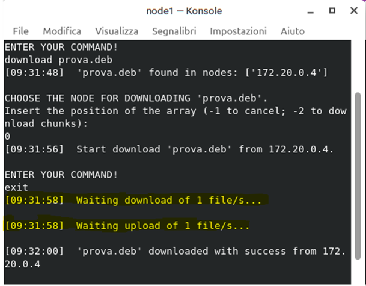

# Distributed P2P File Sharing with Docker 🌐🖧🐳


## 🚀 Overview

<p align="center">
    
</p>

This repository contains the project for the **Sistemi Distribuiti e Cloud Computing** exam of the Master's degree in Computer Engineering at the **University of Calabria**, completed in **September 2022**. This project demonstrates key concepts of distributed systems, such as decentralization, scalability, and fault tolerance, while providing a practical implementation using modern tools like Docker.
For a detailed explanation of the project, refer to the **project report** and **project outline** in the `docs/` folder.

---

## 🎯 Project Objective

The primary goal of this project is to design and implement a **peer-to-peer distributed file-sharing system** where the key objectives are:
- Create a **distributed system** where multiple nodes and a central server operate in an isolated and scalable environment simulated through **Docker** containers.
- Develop communication between nodes and the server using Python's `socket` library for data exchange.
- Enable **file sharing and downloading** across nodes in a peer-to-peer network.
- Implement a **fault-tolerant architecture** to maintain system reliability despite peer failures.

➕💡 In addition to the standard functionality required by the project specifications (see project outline in `/docs` folder), an **enhanced download mode** inspired by the **BitTorrent protocol** was implemented.  
- In this mode, the requesting node does not download the file from a single peer but instead performs **parallel downloads** from all peers that own the file.
- Each peer provides a specific portion of the file (chunk), and the requesting node is responsible for reassembling the chunks into the original file.

The resulting system successfully supports:
- The simultaneous execution of multiple nodes and the server in an isolated virtualized network using Docker containers.
- Efficient file sharing and retrieval, including the advanced parallel downloading feature, ensuring scalability and robustness.

---

## 🗂️ Repository Structure

- **`app_p2p_file_sharing/`**: Contains all the Python source code for the project, including the server, individual node logic, and utility scripts.
- **`docs/`**: Contains the project report and outline.
- **`node/`**: Contains the Dockerfile used to build the Docker image for the nodes in the peer-to-peer network.
- **`server/`**: Contains the Dockerfile for building the Docker image representing the central server.
- **`volumes/`**: Includes a subfolder for each node in the network. Each subfolder is a shared volume linked to its respective container, allowing real-time visualization of the files currently available or recently downloaded by the nodes.
- **`logs/`**: Similar to `volumes/`, this folder contains subfolders for each node and the server. These subfolders store logs that can be used to debug errors and monitor the system's behavior.
- **`docker-compose.yml`**: Defines the Docker Compose configuration, specifying all the characteristics of the services (e.g., network settings, volumes, etc.) required to run the system.
- **`config.sh`**: A configuration script for rebuilding the Docker images. It removes any existing images and rebuilds the `node` and `server` Dockerfiles.
- **`reset.sh`**:  A script to reset the entire application. It deletes logs, stops and removes all running containers, and cleans up temporary configuration files.  
  > **Note**: When used with the `-v` option, it restores the files within the network nodes.
- **`run.sh`**: A script to start the entire application. It launches the server and nodes in separate terminals.  
  > **Note**: The number of nodes can be specified with the `-n` parameter, or individual node names can be provided with the `-nn` option.  
  > **Limitation**: The system currently supports a maximum of 10 nodes.
- **`README.txt`**: A plain-text file with a brief explanation of how to start the project.

---

## 🛠️ System Architecture

The system is designed as a **distributed peer-to-peer network** for file sharing. It consists of the following key components and their interactions:

### Components:
**📡 Central Server**:
   - Acts as a **tracker** for the network.
   - Maintains a **registry of connected nodes** and metadata about the files available in the system.
   - Coordinates file-sharing operations by providing information about which peers own a requested file.

**🔗 Peer Nodes**:
   - Represent individual clients in the peer-to-peer network.
   - Each node can act as both:
     - **File Provider**: Shares files stored in its local volume.
     - **File Requester**: Requests and downloads files from other peers in the network.
   - Peers communicate directly with each other using Python's `socket` library.

**🌐 Dockerized Network**:
   - The entire system is containerized using **Docker Engine**, ensuring:
     - Isolation of server and nodes as separate containers.
     - A scalable and consistent runtime environment.

### Workflow:

**📡 Node Registration**:
   - When a node starts, it registers itself with the server by sharing its IP address and the list of files it owns.

**👀 Periodic Peer Monitoring**:
   - The server continuously monitors all connected nodes.
   - Nodes notify the server of their presence using to avoid being marked as inactive.

**📤 File Request and Sharing 📥**:
   - A node requests a file from the server.
   - The server identifies which peers own the requested file and provides their information to the requesting node.
   - The requesting node downloads the file:
     - **Standard Mode**: The file is downloaded from a single peer.
     - **Enhanced Mode ✨**: The file is downloaded in chunks from multiple peers and reassembled locally.

---

## 🚀 Running the Project

To get the project up and running, follow these steps:

### 1. Build the Docker Images 🐳
Run the `config.sh` script to build the server and node images from their respective Dockerfiles.  
⚠️ **Warning**: This will remove all existing Docker images. To prevent this, use the `-nr` flag to avoid removing other images.

```bash
./config.sh
```
### 2. Start the Application ⚙️
Run the `run.sh` script to start the server and nodes. You have several options to customize the startup:

**Start the Server**:
```bash
./run.sh -s 1
```
This will start the server. The `1` is mandatory to initialize the server.

**Start a Node**:
```bash
./run.sh -n x
```
Where `x` is the number of the node (from 1 to 10). This command will start the node with the specified number.

**Start a Node by name**:
```bash
./run.sh -nn N
```
Where `N` is the name of the node (e.g., `node5`). This command will start the node with the given name.

### 3. Play and Enjoy! 🎮

Once the server and nodes are up and running, you can start enjoying the **P2P File Sharing App**!  
Test the peer-to-peer file sharing functionality by downloading and sharing files between the nodes. The app simulates a network of nodes that can exchange files, providing a great opportunity to see how the system handles multiple peers simultaneously.

### 4. Clean Up 🧹

When you're finished, make sure to clean up the environment. Run the `reset.sh` script to:

- Remove temporary files
- Stop and delete running Docker containers
- Delete configuration files

```bash
./reset.sh
```

If you want to restore the files on the nodes to their initial state, you can use the `-v` flag:
```bash
./reset.sh -v
```
This will also reset the files inside the volumes, making the nodes go back to their original configuration (files in `.volumes_start/` will be copied to `volumes/` folder).


**Note**: The entire setup works only on **Linux**. 🐧 
This project is designed to run on Linux-based systems. If you're using another operating system, you may encounter compatibility issues or need to make adjustments to the environment, such as installing Docker and configuring files bash.

---

## 🖼️ Screenshots
Here are some screenshots demonstrating the application’s interface:

### 1. **Server and Nodes Terminal Overview**
<p align="center">
    
</p>

### 2. **Commands Overview ⌨️**
<p align="center">
    
    
    
    
    
    
    
</p>
